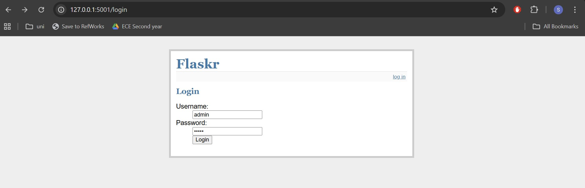
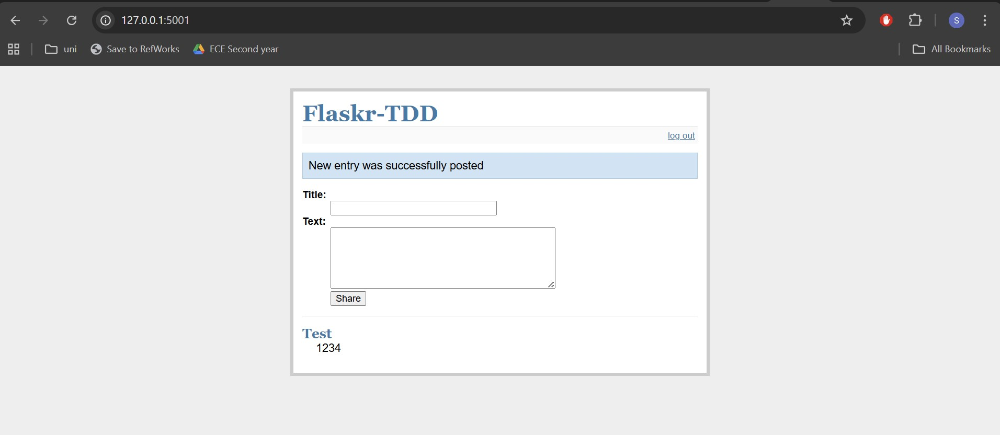
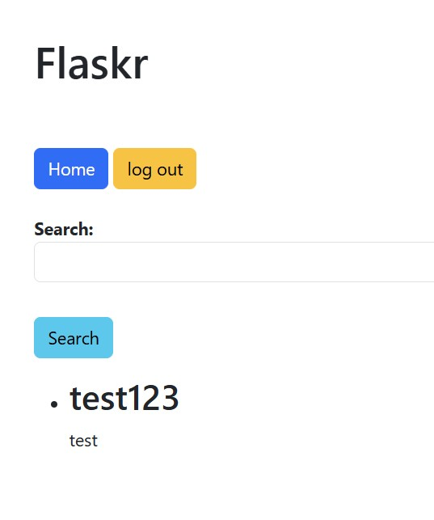
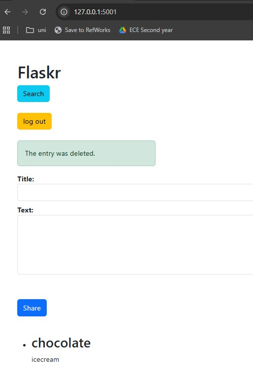
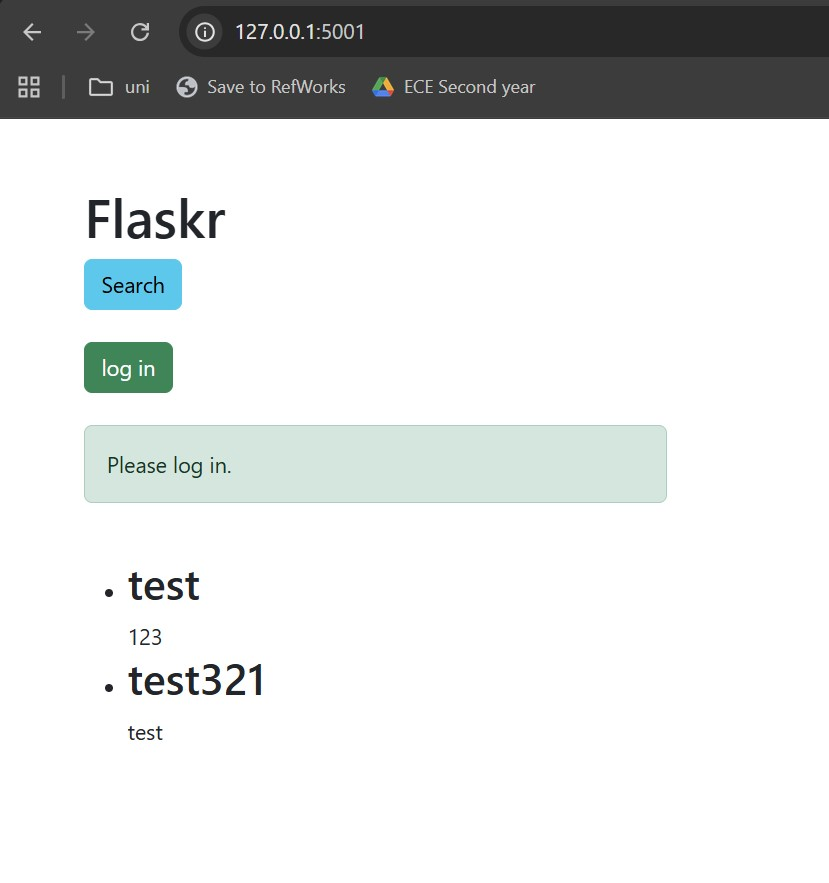
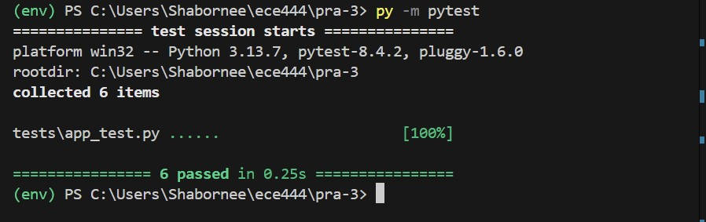
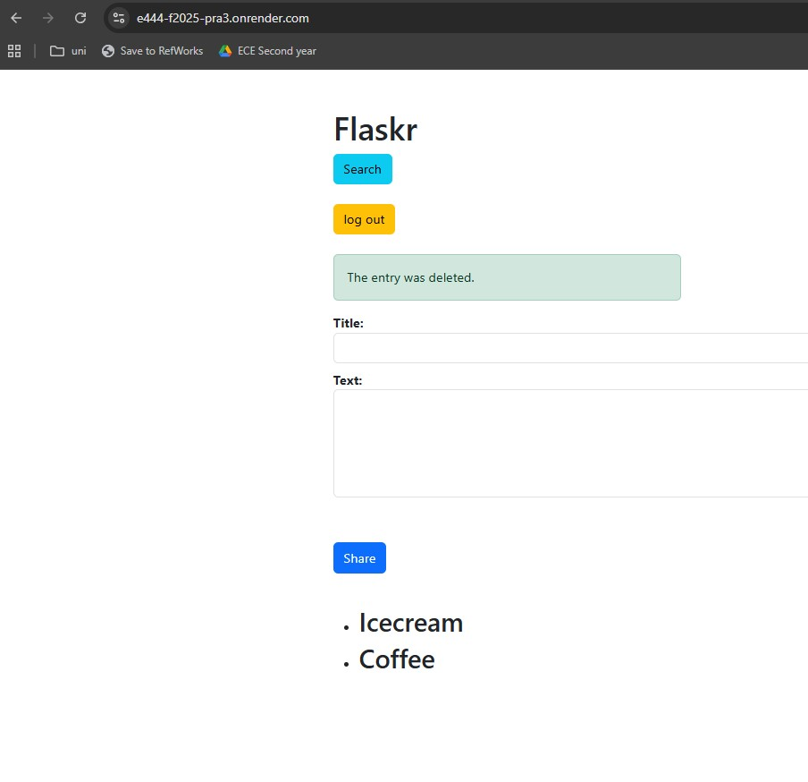
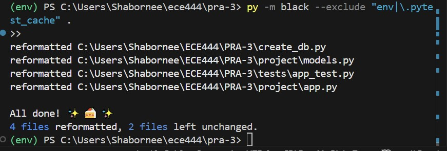

# E444-F2025-PRA3

# Activity 1.1 ⚡️ 
- User Login and Logout

# Activity 1.2 ⚡️ 
- New CSS changes

# Activity 1.3 ⚡️ 
- Search 

# Activity 1.4 ⚡️ 
- Delete 

# Activity 1.5 ⚡️ 
- Login Required for Delete 

# Activity 1.6 ⚡️ 
- All tests passes

# Activity 1.7 ⚡️ 
- On render fully functional

# Activity 1.8 ⚡️ 
- Reformatting

